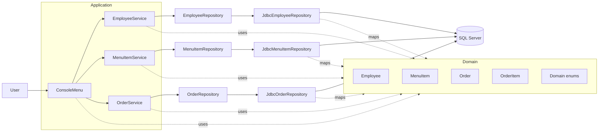
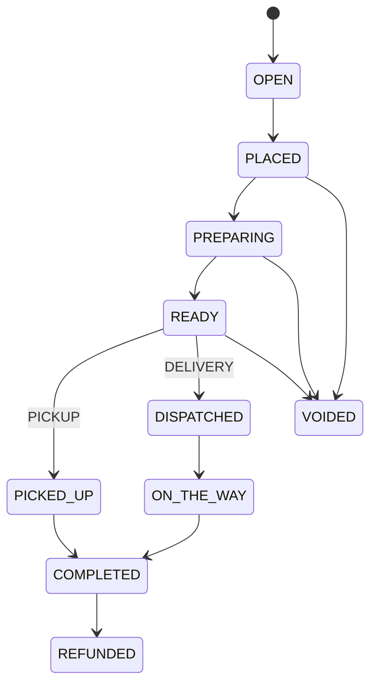
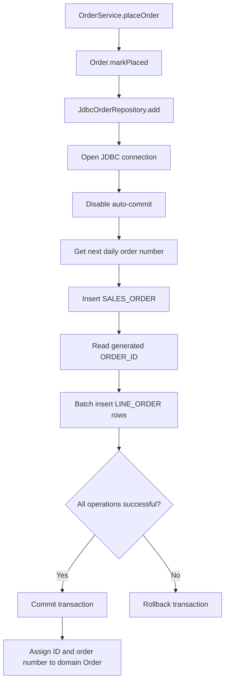
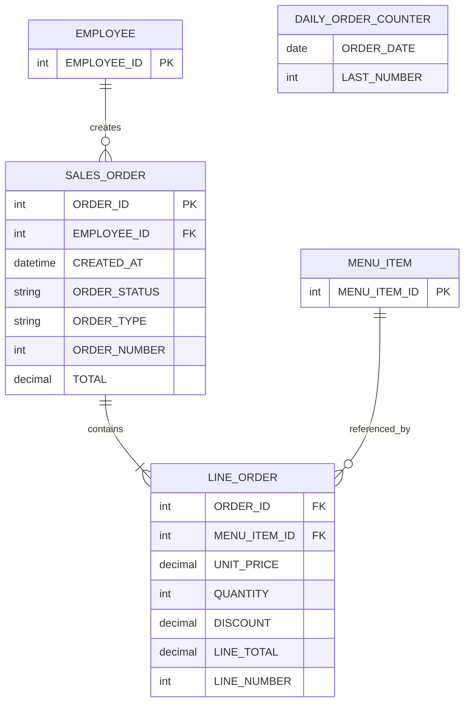

# Architecture

## 1. System Shape

Restaurant Operations System is a small **layered monolith**.

A single JVM process hosts:

- the interactive console,
- application services,
- domain objects,
- repository adapters,
- JDBC access to SQL Server.

There is no HTTP layer, application server, or network boundary between the internal layers.



The main dependency direction is:

```text
UI → Services → Repository interfaces → Repository implementations → Database
 ____________________ Domain model used across these layers __________________/
```

## 2. Composition Root

`Main` is the composition root.

At startup it creates:

1. `JdbcEmployeeRepository`
2. `JdbcMenuItemRepository`
3. `JdbcOrderRepository`
4. the three corresponding services
5. `ConsoleMenu`

It then calls `ConsoleMenu.start()`.

This keeps dependency construction explicit and avoids global service locators or framework-managed injection.

## 3. Presentation Layer

### `ui.ConsoleMenu`

`ConsoleMenu` owns the interactive console workflow.

Its responsibilities include:

- rendering menus,
- reading and normalizing user input,
- choosing employees, menu items, and orders,
- creating domain objects from input,
- invoking service methods,
- displaying results,
- converting expected validation/state errors into readable console messages.

It depends on:

- `EmployeeService`
- `MenuItemService`
- `OrderService`

It does **not** execute SQL directly.

### Current trade-off

`ConsoleMenu` is the largest class in the project and currently combines:

- navigation,
- parsing,
- selection,
- presentation,
- workflow coordination.

That is acceptable for the current console scope, but it is the most obvious candidate for extraction if the UI grows.

## 4. Application / Service Layer

The service layer exposes application use cases and coordinates repositories.

### `EmployeeService`

Responsible for employee-related use cases such as creation, lookup, updates, activation, and deactivation.

### `MenuItemService`

Responsible for menu-item use cases such as creation, lookup, edits, and availability changes.

### `OrderService`

Responsible for order use cases such as:

- placing an order,
- retrieving orders,
- progressing order status,
- completing orders,
- cancelling orders.

Services depend on repository **interfaces**, supplied through constructors.

This is the key boundary that keeps use-case logic independent from JDBC.

## 5. Domain Layer

The domain layer contains the business state and rules.

It has no dependency on JDBC, SQL Server, or the console UI.

### `Employee`

Represents restaurant staff data and employee lifecycle state.

### `MenuItem`

Represents a sellable menu item, including name, price, category, and availability.

### `Order`

Owns:

- employee reference,
- creation time,
- order type,
- order number,
- order status,
- line items,
- total calculation,
- editability,
- legal status transitions,
- void/refund rules.

Important domain behavior includes:

- items may only be edited while an order is `OPEN`,
- an empty order cannot be placed,
- pickup and delivery orders follow different completion paths,
- only selected active states can be voided,
- only completed orders can be refunded.

### `OrderItem`

Represents an order-line snapshot.

It stores:

- a menu-item reference,
- quantity,
- unit price,
- discount percentage.

The line total is calculated from the stored unit price and discount.

This means an order line does not depend on the menu item's price remaining unchanged later.

## 6. Order State Machine



The state transitions are represented as methods on `Order`, rather than exposing an unrestricted public status setter.

That prevents callers from directly moving an order into an invalid state.

## 7. Persistence Layer

Repository interfaces define storage operations.

The current JDBC adapters are:

- `JdbcEmployeeRepository`
- `JdbcMenuItemRepository`
- `JdbcOrderRepository`

Database connections are opened through `DatabaseConnection`, which reads:

- `DB_URL`
- `DB_USER`
- `DB_PASSWORD`

from environment variables.

Prepared statements are used for database operations.

## 8. Order Aggregate Persistence

`JdbcOrderRepository` is the most involved persistence adapter because an order spans multiple database records.

When an order is added:



The repository only assigns the generated database ID and daily order number back to the domain object **after the transaction commits successfully**.

This prevents the in-memory object from appearing persisted when the database transaction actually failed.

## 9. Persistence Model

The repository SQL shows this core relationship model:



### ID vs order number

The application distinguishes two concepts:

- `ORDER_ID`: database identity used internally for persistence.
- `ORDER_NUMBER`: human-facing number generated per business day.

`DAILY_ORDER_COUNTER` supports this daily numbering mechanism.

## 10. Runtime Order Flow

A typical order creation workflow is:

1. `ConsoleMenu` loads employees through `EmployeeService`.
2. The user selects an active employee.
3. The UI reads an `OrderType`.
4. The UI creates a new `Order`, initially `OPEN`.
5. Available menu items are loaded through `MenuItemService`.
6. The UI creates one or more `OrderItem` objects and adds them to the order.
7. The UI calls `OrderService.placeOrder(order)`.
8. `OrderService` asks the domain object to transition to `PLACED`.
9. `JdbcOrderRepository` persists the order and lines transactionally.
10. Later status updates are requested through `OrderService`, which reloads the order, invokes the legal domain transition, and persists the new status.

## 11. Testing Structure

Tests are grouped by responsibility:

```text
src/test/java/com/jadmatar/restaurant/
├── domain/
├── service/
├── repository/
└── ui/
```

The project includes:

- domain behavior tests,
- service tests,
- repository tests,
- JDBC integration tests,
- console-menu tests.

JDBC integration tests use the Maven-provided test database configuration.

Because integration tests can modify database state, the configured database should always be isolated from non-test data.

## 12. Architectural Strengths

The current architecture has several useful properties:

- **Separation of concerns** between UI, use cases, domain rules, and persistence.
- **Dependency inversion at the persistence boundary** through repository interfaces.
- **Constructor injection** keeps service dependencies visible and testable.
- **Domain-owned order transitions** prevent arbitrary status mutation.
- **Transactional order creation** protects aggregate consistency.
- **Prepared statements** keep SQL parameterization explicit.
- **Price snapshotting** preserves historical order-line values.
- **No framework magic** makes control flow easy to trace while learning core Java architecture.

## 13. Current Constraints

The current scope also has deliberate limitations:

- database schema creation and migrations are not included,
- database configuration is environment-based with minimal startup validation,
- the application is console-only,
- there is no authentication or authorization boundary,
- `ConsoleMenu` has accumulated several responsibilities,
- dependency composition is manual,
- integration tests require a live SQL Server test database.

## 14. Natural Evolution Path

If the project grows, a low-risk evolution would be:

1. extract console input/parsing and presentation helpers from `ConsoleMenu`,
2. add versioned database migrations,
3. centralize typed configuration and startup validation,
4. keep the current services and domain model,
5. add another presentation adapter, such as a REST API or GUI,
6. add authentication and authorization before exposing operations remotely,
7. introduce a dependency-injection framework only when manual wiring becomes genuinely costly.

The important architectural idea is that the **domain and service contracts can remain stable while the UI and persistence adapters evolve around them**.
