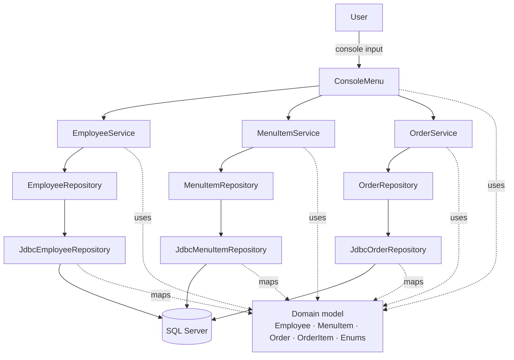
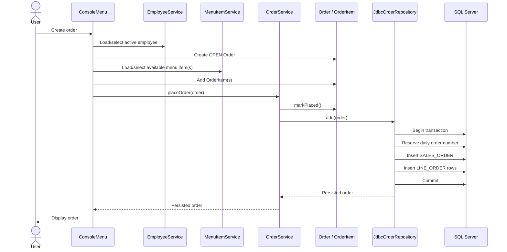
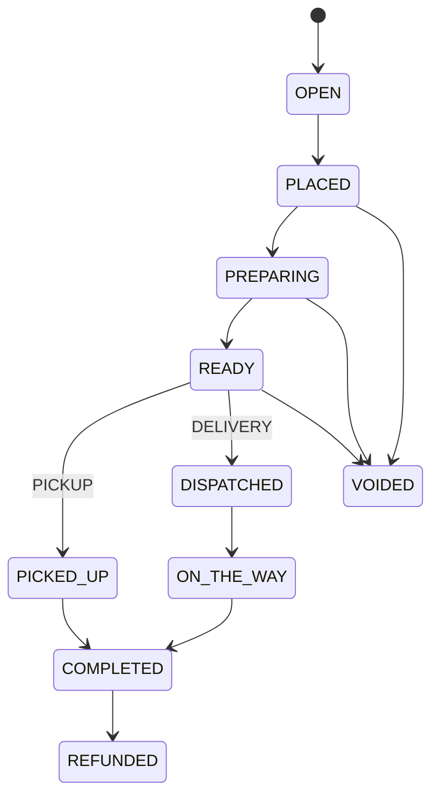
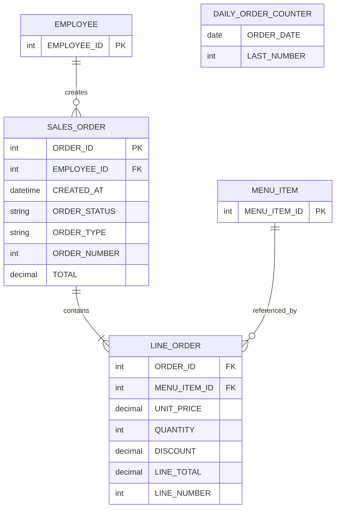

# Restaurant Operations System

A Java console application that models core restaurant operations around **employees, menu items, and customer orders**.

The project is intentionally structured as a layered monolith: the console UI handles interaction, services coordinate use cases, domain objects enforce business rules, repository interfaces isolate persistence, and JDBC adapters store data in Microsoft SQL Server.

> This project was built as a portfolio and learning project focused on Java application architecture, domain modeling, JDBC, SQL persistence, testing, and dependency separation.

## Highlights

- Employee management: create, find, list, rename, deactivate, and reactivate employees.
- Menu management: create, find, list, edit name/price/category, and toggle availability.
- Order management: create orders, add multiple items, apply quantities and discounts, list/view orders, and manage order status.
- Domain-owned validation and legal order-state transitions.
- Repository interfaces separating application logic from persistence.
- JDBC persistence using prepared statements and explicit row-to-domain mapping.
- Transactional order creation so the order header and its line items are persisted together.
- SQL Server-backed daily order numbering.
- Automated tests across domain, service, repository/integration, and console layers.

## Technology Stack

| Area | Technology |
| --- | --- |
| Language | Java 25 |
| Build | Maven |
| Testing | JUnit Jupiter 6.1.2 |
| Database | Microsoft SQL Server |
| Persistence | JDBC |
| UI | Console / `java.util.Scanner` |

## Architecture at a Glance



The application runs in a **single JVM process**. There is no network boundary between layers. `Main` acts as the composition root and manually wires JDBC repositories into the services and the services into the console UI.

For a deeper explanation, see [ARCHITECTURE.md](ARCHITECTURE.md).

## Order Flow

A typical order creation path is:



## Order Lifecycle

The domain model prevents invalid transitions.



`FAST_ORDER` exists as an order type, while the current completion paths in the domain are specifically defined for pickup and delivery orders.

## Persistence Model

The JDBC repositories currently reference the following tables:



`ORDER_ID` is the database identity, while `ORDER_NUMBER` is the human-facing daily order number.

The daily counter is maintained through `DAILY_ORDER_COUNTER` by the order repository.

## Project Structure

```text
src/main/java/com/jadmatar/restaurant/
├── Main.java
├── database/
│   ├── DatabaseConnection.java
│   └── DatabaseConnectionCheck.java
├── domain/
│   ├── Employee.java
│   ├── MenuItem.java
│   ├── Order.java
│   ├── OrderItem.java
│   └── supporting enums
├── repository/
│   ├── repository interfaces
│   ├── JDBC implementations
│   └── in-memory implementations where present
├── service/
│   ├── EmployeeService.java
│   ├── MenuItemService.java
│   └── OrderService.java
└── ui/
    └── ConsoleMenu.java

src/test/java/com/jadmatar/restaurant/
├── domain/
├── repository/
├── service/
└── ui/
```

## Layer Responsibilities

**UI — `ConsoleMenu`**  
Handles navigation, console input, selection workflows, formatting, and user-facing error messages.

**Services — `EmployeeService`, `MenuItemService`, `OrderService`**  
Expose application use cases and coordinate repository calls without containing SQL.

**Domain — entities and enums**  
Own business state, validation, totals, editability, and order-status rules.

**Repositories**  
Define storage contracts. JDBC implementations translate between SQL rows and domain objects.

**Database helpers**  
Provide environment-based JDBC connections and a connectivity check.

## Database Configuration

The application reads its database connection from environment variables:

```text
DB_URL=jdbc:sqlserver://localhost;instanceName=MSSQLSERVER02;databaseName=RestaurantManagement;encrypt=true;trustServerCertificate=true
DB_USER=restaurant_app
DB_PASSWORD=<your-password>
```

Do not commit database credentials.

The Maven test configuration points JDBC integration tests at:

```text
RestaurantManagementTest
```

and obtains `DB_PASSWORD` from the environment.

> Some integration tests modify database state. They should only be run against an isolated test database.

## Prerequisites

- JDK 25
- Maven
- Microsoft SQL Server
- The schema expected by the JDBC repositories:
  - `EMPLOYEE`
  - `MENU_ITEM`
  - `SALES_ORDER`
  - `LINE_ORDER`
  - `DAILY_ORDER_COUNTER`

The repository currently does **not** include schema migrations or schema-creation scripts, so the database must be provisioned separately.

## Build and Test

```bash
mvn clean test
```

The full test suite includes JDBC integration tests, so SQL Server and the configured test database must be available for the complete run.

## Running the Application

1. Configure `DB_URL`, `DB_USER`, and `DB_PASSWORD`.
2. Ensure the expected SQL Server schema exists.
3. Run `com.jadmatar.restaurant.Main`.

The console then exposes employee, menu-item, and order workflows.

## Design Decisions

A few deliberate choices in this project:

- **Manual dependency injection:** `Main` explicitly constructs and connects repositories, services, and the UI.
- **Repository abstraction:** services depend on interfaces instead of JDBC classes.
- **Domain behavior:** order transitions are methods on `Order`, rather than arbitrary status assignments.
- **Transactional aggregate persistence:** order headers and order lines are stored in one JDBC transaction.
- **Price snapshotting:** `OrderItem` stores the unit price used for the order instead of depending on the menu item's future price.
- **No framework dependency:** the project stays close to core Java/JDBC to make the architecture and data flow explicit.

## Current Scope

This is currently a **console-based local application**. It does not yet include:

- a web API or GUI,
- authentication or authorization,
- automated schema migrations,
- external configuration files,
- a dependency-injection framework.

Those are natural future extensions, but they are intentionally outside the current implementation.

## Documentation

See [ARCHITECTURE.md](ARCHITECTURE.md) for:

- component responsibilities,
- dependency direction,
- persistence boundaries,
- order persistence internals,
- testing structure,
- current architectural trade-offs.
